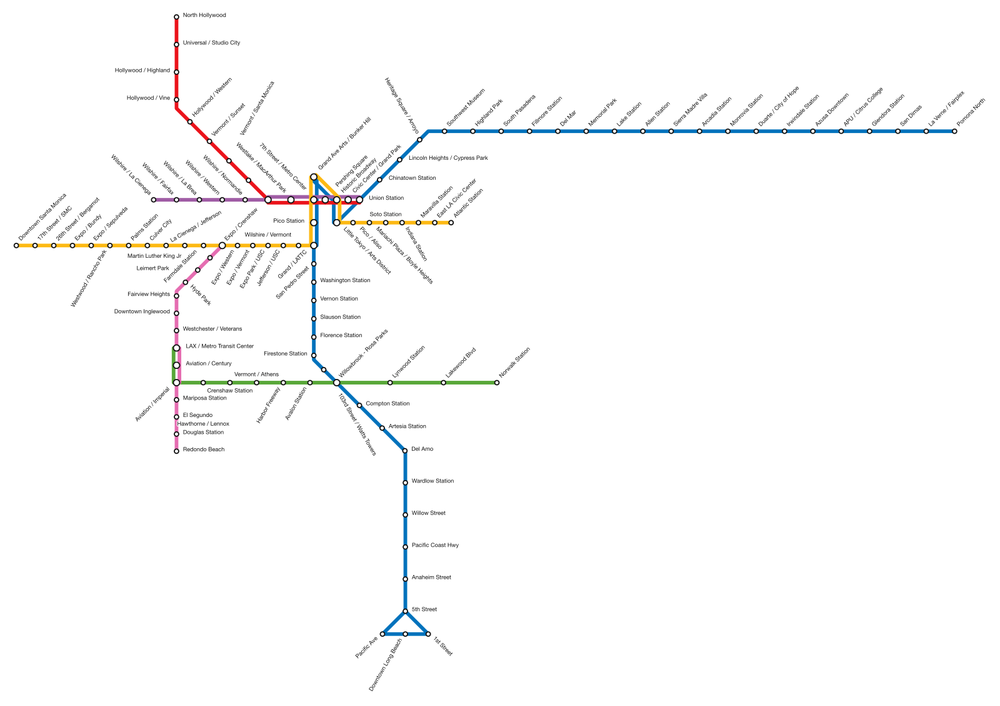

# OpenSchematicMaps

Exploration into creating schematic maps using open source solutions.

Generates a **schematic transit map** (a tube-map-style SVG) and an
**interactive animation of trains running the day's timetable**, from nothing
but a city's public GTFS feed.



The pipeline is city-agnostic. LA Metro rail is the worked example; BART and
TriMet MAX run through the same code with only a registry entry added.

## How it works

[LOOM](https://github.com/ad-freiburg/loom) (University of Freiburg, GPL-3.0)
does the hard part — turning a geographic network into an octilinear one:

```
GTFS zip → gtfs2graph → topo → loom → octi → schematic line graph
```

`topo` merges overlapping track, `loom` solves the left-to-right ordering of
lines on each edge, and `octi` snaps the whole network to a 45° grid. Every
stage speaks the same GeoJSON line-graph format, so each can be inspected on its
own.

From there this repo takes over:

- **`render.py`** draws the SVG, using LOOM's solved line ordering to offset
  parallel tracks, and giving every (line, edge) a stable element id.
- **`labels.py`** places station names, rotating them off the line and testing
  collisions with oriented boxes.
- **`schedule.py`** resolves a service day and maps GTFS stops onto map nodes.
- **`animate.py`** routes each trip across the drawn network and emits a
  self-contained HTML page that runs the trains.

LOOM's own `transitmap` renderer is used as a cross-check, not as the output —
the animation needs geometry it can address by id.

OpenStreetMap is not needed for these feeds: they all ship `shapes.txt`. If a
feed has poor or missing shapes, run it through
[pfaedle](https://github.com/ad-freiburg/pfaedle) first (note that makes the
result ODbL).

## Networks

22 rail networks are registered and build from their feeds
(2,670 stations, 38,273 trips between them) — twenty-one in
the US, plus the Mexico City Metro from an archived 2025 snapshot. `bin/run-all` rebuilds the lot in
about fifteen seconds once the feeds are cached; `bin/gallery` writes
`out/index.html`, a contact sheet linking every map and animation.

| Network | Stations | Lines |
|---|--:|--:|
| New York City Subway | 402 | 27 |
| Mexico City Metro | 165 | 12 |
| Metra | 240 | 11 |
| NJ Transit Rail | 229 | 17 |
| Muni Metro | 160 | 7 |
| TriMet MAX | 159 | 8 |
| SEPTA Regional Rail | 156 | 13 |
| Chicago 'L' | 144 | 8 |
| MBTA Subway | 126 | 8 |
| Long Island Rail Road | 126 | 12 |
| LA Metro Rail | 110 | 6 |
| RTD Denver Rail | 89 | 10 |
| UTA TRAX & FrontRunner | 77 | 5 |
| Valley Metro Rail | 76 | 4 |
| DART Light Rail | 67 | 4 |
| Sound Transit Link & Sounder | 62 | 5 |
| Pittsburgh Light Rail | 58 | 5 |
| Cleveland RTA Rapid | 54 | 4 |
| BART | 51 | 8 |
| Miami Metrorail & Metromover | 43 | 3 |
| MARTA Rail | 38 | 4 |
| Metro Transit Light Rail | 38 | 3 |

Not registered: **WMATA** (Washington DC) publishes GTFS only behind an API key.
Mexico City's own open-data host does not answer, so that feed comes from
MobilityData's mirror and its service period ended in December 2025.

## The site

Published at **https://richc117.github.io/legible-cities/**

`site/` is an Eleventy build of a standalone site — an essay on why schematic
maps matter, an atlas of all 22 networks, and a framework page crediting the work this
rests on. It reuses the design tokens, typography and theme switch from the
personal-site portfolio so the two read as one hand.

```bash
bin/build-site            # regenerate every map, then build site/dist
bin/build-site --serve    # ...and watch
bin/preview-site          # serve site/dist at localhost:4321
```

`site/src/_data/networks.json` and `site/src/maps/` are generated by
`schematic.site.export()`, never edited by hand, so the numbers on the atlas
cannot drift from the maps beside them.

## Setup

```bash
uv venv && uv pip install -e .
docker build -t openschematicmaps/loom docker/
```

The Dockerfile builds LOOM natively for your architecture with the open ILP
solvers. (Upstream's pins Ubuntu 20.04 and downloads Gurobi's linux64 tarball,
which forces amd64 emulation on Apple Silicon.)

## Use

```python
from schematic import pipeline

result = pipeline.run("la-metro-rail")
print(result.summary())
```

Writes `out/la-metro-rail.svg`, `out/la-metro-rail.html` and
`out/la-metro-rail.positions.json`. Open the HTML in a browser: a clock, a
time-of-day scrubber, playback speeds, per-line toggles, a **Linear** view that
unfolds the map into one row per line (sortable by name or station count), a
**Time** view that plots the whole service day as a Marey chart, and a
**Labels** button that hides the station names — dense networks read far better without
them when you are watching the trains, and hiding them also tightens the view
onto the network.

`bin/run-all` runs every registered feed and prints a table of what worked.

The notebooks in `notebooks/` walk the same pipeline one stage at a time, and
are the place to start if you want to see what each tool does.

```bash
pytest                                  # unit tests, plus end-to-end checks
bin/preview out/la-metro-rail.svg       # rasterise an SVG to look at it
```

## Making assets

`bin/export` turns a built network into files sized for somewhere specific — a
reel, a post, a figure in an essay — with the visualization on its own and none
of the site's interface around it.

```bash
bin/export --list                                    # presets and storyboards
bin/export la-metro-rail --preset instagram-reel
bin/export cdmx-metro -p instagram-post --view time --no-labels
bin/export nyc-subway -p portfolio-svg               # the theme pair essays use
bin/export la-metro-rail -p instagram-reel --dry-run # print the URL, write nothing
```

Everything lands in `~/Desktop/legible-cities/<feed>/` — never in the repo — with
a `.json` beside each file recording what it is, the network's own caveats, and
alt text to paste. `--quality draft|standard|high`, `--theme`, `--at 07:30`,
`--lines A,B`, `--exclude SIR`, `--storyboard`, `--fade` and `--sheet` are the
rest of it; `--list` prints the presets. `--exclude` matters more than it
sounds: New York's Staten Island Railway is genuinely disconnected from the
rest of the system, so it sits off on its own diagonal and roughly doubles
the bounding box, shrinking the subway to fit beside it.

`--safe-area` writes an extra preview showing where Instagram draws its own
interface over a reel or story. It goes in a `safe-area/` subfolder and is
never a deliverable -- it is covered in magenta guides. Only Instagram's
portrait surfaces have such an overlay; other platforms show the image in a
card with nothing on top of it.

The same thing is reachable by hand. Every animation page takes presentation
parameters, so you can open one clean in a browser to present from or to record
yourself:

```
site/dist/maps/cdmx-metro.html?present=1&view=time&clock=1&title=1&frame=9:16
```

Exports are reproducible: the page's clock is stepped by hand, one frame at a
time, so running the same command twice produces byte-identical output.
`notebooks/06_export_assets.ipynb` walks through it.

## Adding a city

One entry in `FEEDS` in `src/schematic/feeds.py`:

```python
"bart": Feed(
    key="bart",
    name="BART",
    url="https://www.bart.gov/dev/schedules/google_transit.zip",
    mode="all",
    label_strip=r"-[NSEW]$",   # BART splits each line by direction
),
```

`mode` is LOOM's `-m` filter (`tram`, `subway`, `rail`, `all`, …) — for a
combined bus-and-rail feed, this is what keeps the map to rail. `label_pattern`
and `label_strip` clean up route labels; most feeds need neither.

`bin/run-all <key>` runs one; with no argument it runs the lot.
